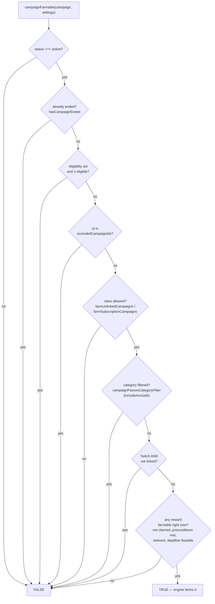
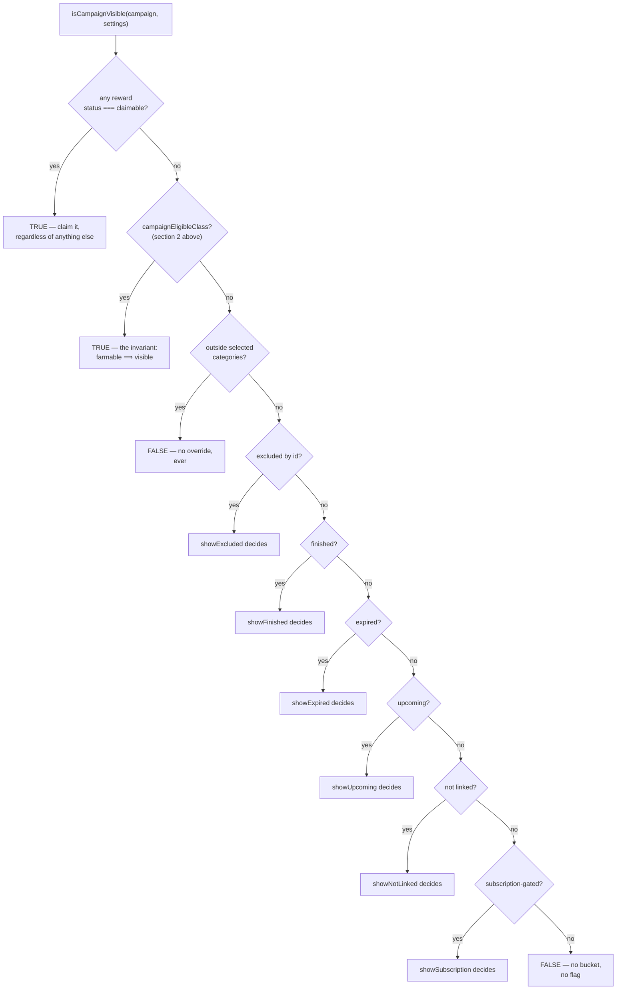

# Farmability & Visibility — shared campaign evaluation

Two questions, one shared foundation.

- `evaluateCampaignFarming` answers **"will the engine actually watch this, and if not, why?"**
- `campaignFarmable` is the boolean compatibility wrapper around that evaluation.
- `isCampaignVisible` answers **"does it show in the popup's Drops list?"**

Both are built from the same `campaignEligibleClass` check, so a campaign the
engine is farming can never be hidden from the person watching it happen.

## 1. Can the engine farm it right now? — `campaignFarmable`

Used by the scheduler's `isEligible`. Six structural gates, then one timing
gate on the rewards themselves.

`evaluateCampaignFarming` applies these gates and returns either
`{ farmable: true }` or one stable rejection code plus relevant context such
as the blocked reward and deadline. `campaignFarmable` delegates to it and
returns only the boolean result.

The scheduler aggregates these results after each refresh (including an
explicit `0 farmable` count) and emits per-campaign diagnostics for active
rejections. A fingerprint suppresses identical snapshots until campaign data
or settings change. The popup evaluates the same campaign with priority mode
included, showing a compact warning on collapsed cards and the localized full
reason when expanded.

## 2. Is it in a farmable class at all? — `campaignEligibleClass`

The first six gates above, on their own, ignoring reward timing entirely —
just "does this campaign have anything left to earn or claim." This is the
shape both farmability and visibility are built from.

> **Why split it out:** a campaign can fail the reward-timing gate (deadline
> too tight, a locked follow-up reward) without being structurally dead.
> Hiding it would also hide it from `campaignPriorities` drag-reordering — in
> "priority list only" mode that's the *only* way to make a campaign
> farmable, so visibility deliberately stops one gate short of full
> farmability.

## 3. What shows in the popup? — `isCampaignVisible`

Two fast paths first, then the category filter (no override, always wins),
then one bucket per remaining reason with its own display flag. The first
`true` reason wins — buckets are checked in this fixed order.

## Reference

| function | answers | used by |
|---|---|---|
| `evaluateCampaignFarming` | can it be farmed now; if not, what stable rejection code and context explain why? | scheduler diagnostics, popup view model, `campaignFarmable` |
| `campaignEligibleClass` | could this campaign's class ever be farmed, ignoring reward timing? | `campaignFarmable`, `isCampaignVisible` |
| `campaignFarmable` | eligible class, and a reward is farmable right this moment | `isEligible` (scheduler) |
| `isCampaignVisible` | should the Drops list render this campaign? | the popup (`Popup.tsx`) |
| `isRewardFarmableNow` | not claimed, preconditions met, in its window, deadline feasible | `campaignFarmable` |
| `campaignPassesFarmingEligibility` | is this campaign's class (not-linked / subscription) allowed at all? | `campaignEligibleClass` |

## The relationship that matters most

`campaignEligibleClass` is the shared base.

- `campaignFarmable` = that base **+** one extra reward-timing check (used
  for actual farming decisions).
- `isCampaignVisible` uses **only** the base, never the extra check — so a
  campaign that's momentarily un-farmable for timing reasons (tight deadline,
  unmet precondition) stays visible instead of vanishing, and the category
  filter is checked before all the display-flag buckets since nothing
  overrides it.

---
*Source: `packages/shared/src/campaignFarming.ts`, `packages/shared/src/campaignFilters.ts`, `packages/shared/src/rewards.ts`*
